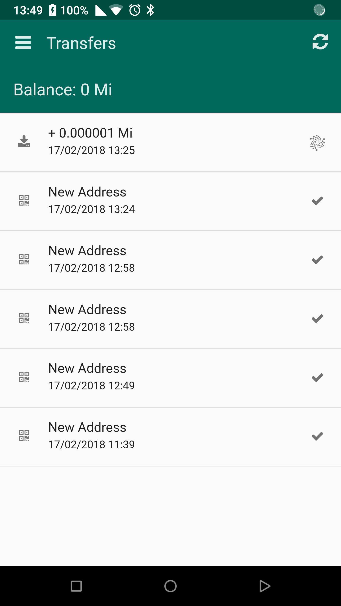
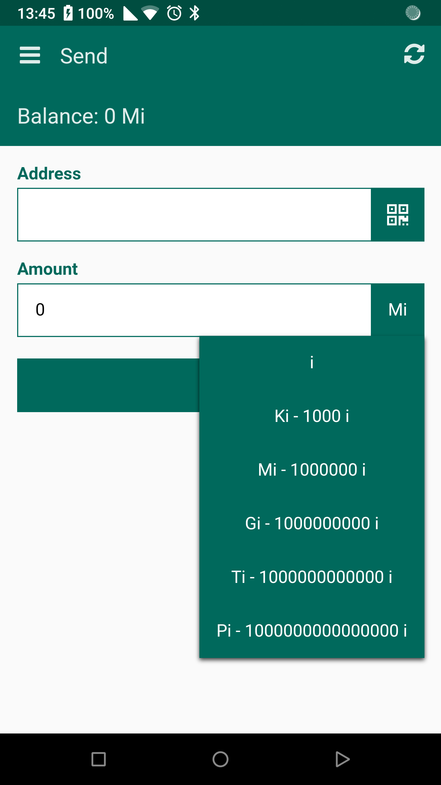
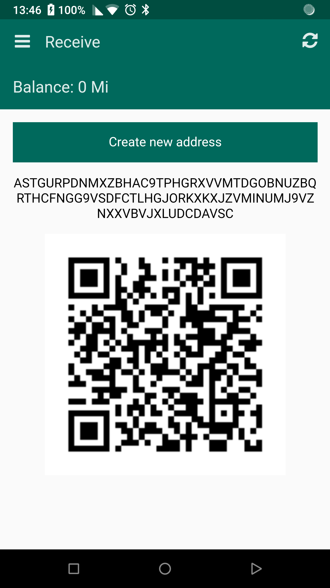

# IC IOTA Wallet
  

# Download
Android:

https://play.google.com/store/apps/details?id=org.iota.community.wallet

IOS:

Apple don't approve apps using the iota protocol for now.

# Build
	Requirments:
	* nodeJS
	* npm
	* cordova
	* Android SDK (only for Android)
	* XCode (only for IOS)
	* Windows 10 SDK (only for Windows 10)
	
	Run:
	$ npm i
	$ gulp
	
	Android:
	$ cordova platform add android
	$ cordova run android
	
	IOS:
	$ cordova platform add ios
	$ cordova run ios
	
	Windows 10:
	$ cordova platform add windows
	$ cordova run windows
	
	OSX:
	$ cordova platform add osx
	$ cordova run osx

# TODO LIST
https://wallet.iota-community.org/todo
# Donate
	JJ9XSNKALKGZGZGZKZLIENEXPYFGCZQOHRXBYWRXRNUIWGJIDRBFRYGCFEAEKCSRNOYCQP9HFZDFKOWZDFDFOFVFGW
